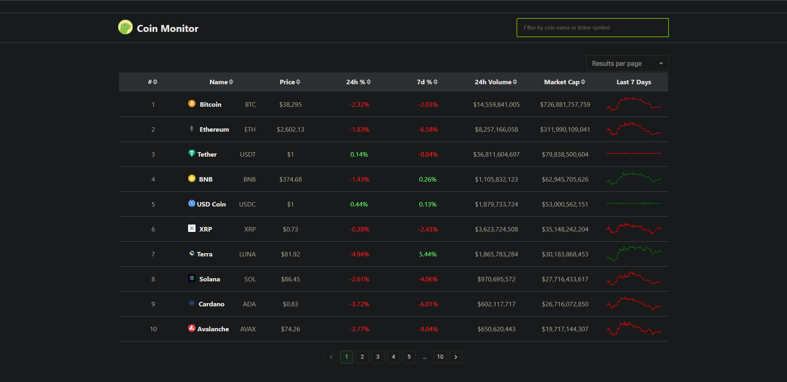

# ReactJS Coin Monitor

This application is a real-time monitor of key performance metrics of the top cryptocurrencies by market capitalization("market cap"). 
It aggregates various types of metrics data from all of those cryptocurrencies and presents it in a tabular layout where the user can easily check each of those performance metrics for each coin like current price, color-coded price change in the last 24h and last 7 days, total trading volume in the last 24h, total market cap and a sparkline chart that provides a visual color-coded representation of the price history over the last 7 days. 
It lets you easily find coins and groups of coins by allowing you to manually search for them by their name or ticker symbol. 
By default the coins are ranked by their market cap but the user can rank them by any of the other metrics as well by clicking the small sorting arrows present in each column. 
It allows for further organization of the displayed data by allowing the choosing of the size of the results per page while also providing pagination that adaps to the selected page size enabling the user to navigate through the different result pages. 
The app keeps all the data up-to-date in real time and sources it from the CoinGecko API. 
It also uses the QuickChart API to generate the 7-day price history sparklines from a set of data points provided by the CoinGecko API for each coin.

This web app was built with:
* ReactJS
* React Hooks
* JS Fetch API
* Material UI
* CoinGecko API
* QuickChart API

Click <a href="https://adtx.github.io/coin_monitor_reactjs/" target="_blank">here</a> to try out the app for yourself.
